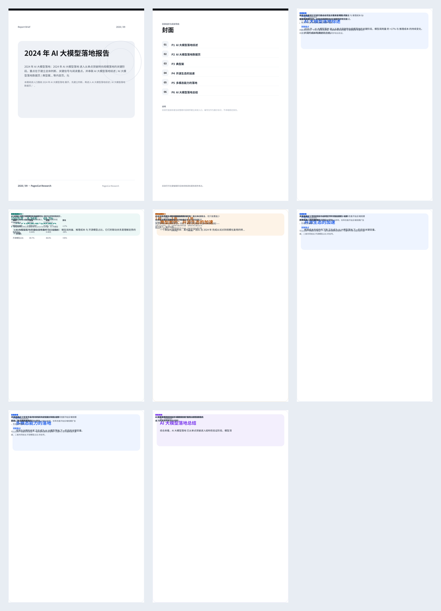
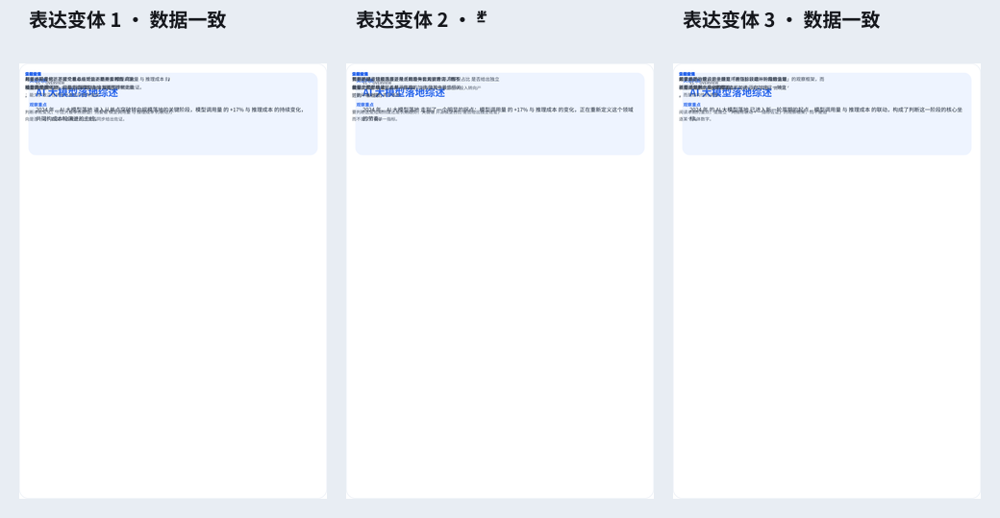

# PagesCut 成品预览

本目录存放确定性内容引擎产出的一份**完整刊物成品**的预览文件，供直接查看。

生成主题：

> 请生成一份关于 2024 年 AI 大模型落地情况的报告，至少 6 页

## 快速查看

### 一图看全（推荐）



### 各页单看

| 文件 | 说明 |
| --- | --- |
| [00-封面.png](00-封面.png) | 封面（kicker / 期号 / 主标题 / 副标题 / 品牌） |
| [00-目录.png](00-目录.png) | 目录（编号 + 6 个条目） |
| [01-AI-大模型落地综述.png](01-AI-大模型落地综述.png) | 综述页（判断驱动） |
| [02-AI-大模型落地数据页.png](02-AI-大模型落地数据页.png) | 数据页（图表 / 指标 / 表格） |
| [03-典型案例-开源生态的加速.png](03-典型案例-开源生态的加速.png) | 案例页（叙事驱动） |
| [04-开源生态的加速.png](04-开源生态的加速.png) | 专题页 |
| [05-多模态能力的落地.png](05-多模态能力的落地.png) | 专题页 |
| [06-AI-大模型落地总结.png](06-AI-大模型落地总结.png) | 总结页（收束驱动） |

### 多版本候选

同一页综述的 3 个表达变体（文案不同、指标数据一致）：



## 真实 HTML 预览（ground truth）

`html/` 目录下是**产品渲染器（`PageModelRenderer`）的直接输出**，比上面的 PNG（近似还原）更接近真实 UI：

- 用浏览器打开 [`html/index.html`](html/index.html) 可逐页导航查看。
- 或单独打开 `html/NN-*.html` 查看某页。

> 说明：PNG 由无浏览器沙箱里的手写 SVG 渲染器近似生成（见 `scripts/README.md`）；
> HTML 是产品 `renderPageModelToHtml` 的逐字输出，以 HTML 为准。

## 如何重新生成

```bash
npm install
# 下载 Noto Sans SC 字体（NotoSansSC-Regular.ttf / NotoSansSC-Bold.ttf）到 scripts/

# 真实 HTML 预览（无需字体）
npx tsx --tsconfig tsconfig.app.json scripts/full-pipeline.mts

# 完整成品 PNG（需要 sharp/opentype + 字体）
npx tsx --tsconfig tsconfig.app.json scripts/final-product.mts
```
